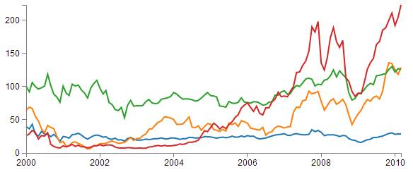
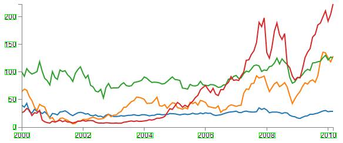

# PROBLEM STATEMENT

### Input 

This image of a graph,having X and Y axes.

### Desired Output 

Input image + rectangular boxes drawn around the markings on the axes.

### Languages 

C++ / Python

### Useful tips

Browse through the OpenCV library documentation and find functions that would be helpful to implement this.

The basic idea of solution, is to find contours (regions, maybe `rectangular` ones) that have atleast a certain level of text density and are on the left side of Y-axis or below the X-axis.

Text can be recognised by the sudden change in intensity level with respect to the background.

But the trick lies in differentiating the X & Y axes from the graph's curve - use Google, StackOverflow and OpenCV tutorials to the maximum extent.

It may be tough to get all the readings accurately. but it's fine.

Good luck!

### Important Note

Coordinates of the origin of the graph should not be hard-coded specific to a particular image. It should work on any similar graph image with 2 perpendicular lines.

Variables like cutoff text density can be hard-coded, but it'd be better if the cutoff is dynamically decided.

### Submission Guidelines

(1) Fork this repository on GitHub.

(2) Clone your fork with `git clone` statement.

(3) Make your local changes, in a sub-directory (say, `graph-detect/<username>/`).

(4) Push these changes to your fork with `git add`, `git commit` and `git push` statements.

(5) Create a Pull Request to this repository by comparing across forks with your fork.